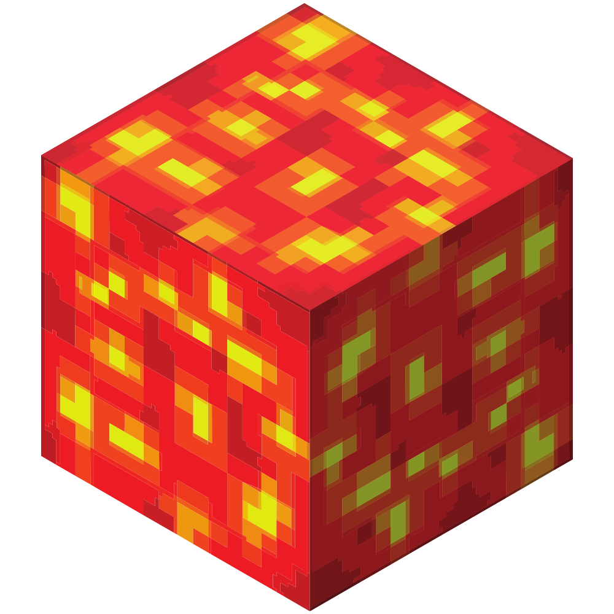

<!-- PROJECT LOGO -->
 

  

<h3 align="center">Squared Additions</h3>

 
    
    
 
 

<!-- PROJECT SHIELDS -->
<!--
*** I am using markdown "reference style" links for readability.
*** Reference links are enclosed in brackets [ ] instead of parentheses ( ).
*** See the bottom of this document for the declaration of the reference variables
*** for contributors-url, forks-url, etc. This is an optional, concise syntax you may use.
*** https://www.markdownguide.org/basic-syntax/#reference-style-links
-->
[![Contributors][contributors-shield]][contributors-url]
[![Forks][forks-shield]][forks-url]
[![Stargazers][stars-shield]][stars-url]
[![Issues][issues-shield]][issues-url]
[![Build status][build-shield]][build-url]
[![Mod side][side-shield]][side-url]
[![Mod loader][loader-shield]][loader-url]
[![MIT License][license-shield]][license-url]
[![Current Modrinth version][modrinth-version-badge]][modrinth-version-url]
[![Modrinth download count][modrinth-downloads-badge]][modrinth-downloads-url]
[![Supported Game Supported Versions][modrinth-supported-game-versions-shield]][modrinth-supported-game-versions-url]

  

    A Minecraft mod for Fabric modloader which adds new blocks, items & other Vanilla+/Create themed stuff.
     
    <a href="#installation"><strong>Go to installation guide »</strong></a></li>
     
    <a href="https://github.com/xYundy/SquaredAdditions/wiki"><strong>Explore the wiki »</strong></a>
     
    <a href="https://github.com/users/xYundy/projects/3"><strong>Check the roadmap »</strong></a>
     
     
    <a href="https://github.com/xYundy/SquaredAdditions/issues/new/choose">Report Bug</a>
    ·
    <a href="https://github.com/xYundy/SquaredAdditions/issues/new/choose">Request Feature</a>
    ·
    <a href="https://github.com/xYundy/SquaredAdditions/issues/new/choose">Request Translation</a>
     
     
    :star: - The star motivates me a lot! Don't wait and became a <a href="https://github.com/xYundy/SquaredAdditions/stargazers">Stargazer</a>!
     
    
     
     
    The project is part of the competition :medal_sports: <a href="https://100commitow.pl">100 commitow</a>.
  

<!-- TABLE OF CONTENTS -->

  
Table of Contents

  <ol>
    <li>
      <a href="#about-the-project">About The Project</a>
      <ul>
        <li><a href="#built-with">Built With</a></li>
      </ul>
    </li>
    <li>
      <a href="#getting-started">Getting Started</a>
      <ul>
        <li><a href="#prerequisites">Prerequisites</a></li>
        <li><a href="#installation">Installation</a></li>
      </ul>
    </li>
    <li><a href="#usage">Usage & mod content</a></li>
    <li><a href="#roadmap">Roadmap</a></li>
    <li><a href="#contributing">Contributing</a></li>
    <li><a href="#license">License</a></li>
    <li><a href="#contact">Contact</a></li>
    <li><a href="#acknowledgments">Acknowledgments</a></li>
  </ol>

<!-- ABOUT THE PROJECT -->
## About The Project

I'm a Minecraft player since I was a child. At that time I don't know how to code. Novadays, I'm a PHP developer who still like playing games. 
When I heard about [_100 commitów_](https://100commitow.pl) contest I have decide to take my chance in it by creating this mod for my favourite game.

I don't code in Java before or create any mod for Minecraft, so this mod will be my first. 

What I want accomplish by developing this project:
* I want to try add different kind of features which will come to my mind watching course created by: [Modding by Kaupenjoe](https://www.youtube.com/@ModdingByKaupenjoe)
* I also like [Create mod](https://modrinth.com/mod/create-fabric) so I want try to integrate with it.
* I want to do thing will make me smile while coding and while playing using this mod on server with friends :smile:
* I want to create mod which will support many languages instead of "english only"

Of course, no one mod will serve all player tastes and/or be "fully completed". So I'll be adding more features in the near future which looks good to me.
You may also suggest changes by forking this repo and creating a pull request or opening an issue. Thanks to all the people have contributed to expanding this mod!

(<a href="#readme-top">back to top</a>)

### Built With

* [![IntelliJIdea][IntelliJIdea]][IntelliJIdea-url]
* [![Fabric][Fabric]][Fabric-url]

(<a href="#readme-top">back to top</a>)

<!-- GETTING STARTED -->
## Getting Started

To use this mod you need to install it to your Minecraft Java Edition instance which has Fabric mod loader installed.

### Prerequisites

* Minecraft Java Edition (1.20.1)
* Fabric mod loader

#### Required mods

* Fabric API

### Installation

#### Available on mod platforms

 
    
 

#### Installation instructions
To install this mod:
1. Download this mod
   1. from [releases](https://github.com/xYundy/SquaredAdditions/releases), [latest build action](https://github.com/xYundy/SquaredAdditions/actions/workflows/build.yml) or [Modrinth](https://modrinth.com/mod/squaredadditions).
   2. or "one-click download and install" using your Minecraft launcher (ex. [Modrinth Launcher](https://modrinth.com/app), [Prism Launcher](https://prismlauncher.org))
2. Place mod `.jar` file in `mods` folder
3. Launch the game

If you don't have Minecraft game and want to test this mod or contribute to the project you can:
1. Clone this repository
2. Run local dev version of Minecraft with this mod installed, using one of methods provided below:
   1. Open it using IntelliJ Idea and launch project using `Minecraft Client` and/or `Minecraft Server` configuration.
   2. Use gradlew `runClient` or `runServer` task

(<a href="#readme-top">back to top</a>)

<!-- USAGE EXAMPLES -->
## Usage & mod content

Current content:
- copper, emerald & rose gold tools
- rose gold ingot & rose gold block
 
 
For info about newest changes, please <a href="https://github.com/xYundy/SquaredAdditions/releases"><strong>check release notes»</strong></a>
 
For more info about content of this mod, please <a href="https://github.com/xYundy/SquaredAdditions/wiki"><strong>explore the wiki »</strong></a> (WIP)

### Photo showcase
<figure>
  
  <figcaption><small>Rose gold, emerald & copper tools added to the game by the mod<small></figcaption>
 
<figure>
  
  <figcaption>Rose gold block & rose gold ingot</figcaption>
</figure>
 
 
*Work in progress*
 
 

### Video showcase

*Work in progress*

(<a href="#readme-top">back to top</a>)

<!-- ROADMAP -->
## Roadmap

See the [open issues](https://github.com/xyundy/squaredadditions/issues) for a full list of proposed features (and known issues).

For current roadmap (aka working board) see [project kanban board](https://github.com/users/xYundy/projects/3).

If you have an idea or sugestion about mod content don't hesitate to <a href="https://github.com/xYundy/SquaredAdditions/issues/new/choose">tell me more about it</a>!

See the [milestones](https://github.com/xYundy/SquaredAdditions/milestones) for a list of features in next mod versions.

(<a href="#readme-top">back to top</a>)

<!-- CONTRIBUTING -->
## Contributing

Contributions are what make the open source community such an amazing place to learn, inspire, and create. Any contributions you make are **greatly appreciated**.

If you have a suggestion that would make this better, please fork the repo and create a pull request. You can also simply open an issue with the tag "enhancement".
Don't forget to give the project a star! Thanks again!

1. Fork the Project
2. Create your Feature Branch (`git checkout -b feature/AmazingFeature`)
3. Commit your Changes (`git commit -m 'Add some AmazingFeature'`)
4. Push to the Branch (`git push origin feature/AmazingFeature`)
5. Open a Pull Request

(<a href="#readme-top">back to top</a>)

<!-- LICENSE -->
## License

Distributed under the MIT License. See `LICENSE` for more information.

(<a href="#readme-top">back to top</a>)

<!-- CONTACT -->
## Contact

Feel free to contact me using one of available methods on my Github profile and/or listed below:

Discord: `xyundy`

Project Link: [https://github.com/xYundy/SquaredAdditions](https://github.com/xYundy/SquaredAdditions)

(<a href="#readme-top">back to top</a>)

<!-- ACKNOWLEDGMENTS -->
## Acknowledgments
* [Modding by Kaupenjoe](https://www.youtube.com/@ModdingByKaupenjoe)
* [Blockbench](https://www.blockbench.net) - A low-poly 3D model editor
* [Img Shields](https://shields.io)
* [Piskel](https://www.piskelapp.com/p/create/sprite)

(<a href="#readme-top">back to top</a>)

<!-- MARKDOWN LINKS & IMAGES -->
<!-- https://www.markdownguide.org/basic-syntax/#reference-style-links -->
[contributors-shield]: https://img.shields.io/github/contributors/xYundy/SquaredAdditions.svg?style=for-the-badge
[contributors-url]: https://github.com/xYundy/SquaredAdditions/graphs/contributors
[forks-shield]: https://img.shields.io/github/forks/xYundy/SquaredAdditions.svg?style=for-the-badge
[forks-url]: https://github.com/xYundy/SquaredAdditions/network/members
[stars-shield]: https://img.shields.io/github/stars/xYundy/SquaredAdditions.svg?style=for-the-badge
[stars-url]: https://github.com/xYundy/SquaredAdditions/stargazers
[issues-shield]: https://img.shields.io/github/issues/xYundy/SquaredAdditions.svg?style=for-the-badge
[issues-url]: https://github.com/othneildrew/Best-README-Template/issues
[license-shield]: https://img.shields.io/github/license/xYundy/SquaredAdditions.svg?style=for-the-badge
[license-url]: https://github.com/xYundy/SquaredAdditions/blob/master/LICENSE
[build-shield]: https://img.shields.io/github/actions/workflow/status/xYundy/SquaredAdditions/build.yml?style=for-the-badge
[build-url]: https://github.com/xYundy/SquaredAdditions/actions/workflows/build.yml
[loader-shield]: https://img.shields.io/badge/mod_loader-fabric-d7cfb5?style=for-the-badge
[loader-url]: https://fabricmc.net/wiki/player:tutorials:start#installing_fabric_loader
[side-shield]: https://img.shields.io/badge/environment-both-4caf50?style=for-the-badge
[side-url]: https://fabricmc.net/wiki/tutorial:side
[modrinth-supported-game-versions-shield]: https://img.shields.io/modrinth/game-versions/uUiBMoXL?style=for-the-badge
[modrinth-supported-game-versions-url]: https://modrinth.com/mod/squaredadditions
[modrinth-version-badge]: https://img.shields.io/modrinth/v/uUiBMoXL?style=for-the-badge&label=Modrinth's%20version
[modrinth-version-url]: https://modrinth.com/mod/squaredadditions/versions
[modrinth-downloads-badge]: https://img.shields.io/modrinth/dt/uUiBMoXL?style=for-the-badge&label=modrinth%20downloads
[modrinth-downloads-url]: https://modrinth.com/mod/squaredadditions/versions

[IntelliJIdea]: https://img.shields.io/badge/IntelliJ_Idea-000000?style=for-the-badge&logo=intellijidea&logoColor=white
[IntelliJIdea-url]: https://www.jetbrains.com/idea/
[Fabric]: https://img.shields.io/badge/Fabric_Mod_Loader-20232A?style=for-the-badge
[Fabric-url]: https://fabricmc.net/
